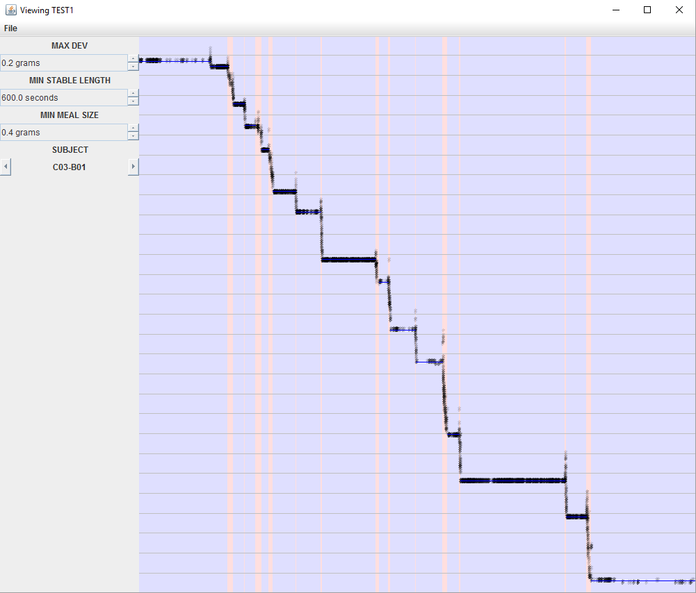

# MealTracker
A java application to analyze food scale readings from animal experiments and extract data about meal sizes and times.

# Input
This application reads data from Omnitech Electronics scales, as saved in a [experiment]_RawDietData.csv file

# Analysis
Scale readings are often noisy due to natural fluctuations as well as animal subjects interacting with the scales.  Single readings are therefore not necessarily realiable indicators of the amount of food consumed.  To extract accurate readings, this program looks for periods of time which the scale does not deviate significantly from a baseline level.  Meals drops in weight between two stable readings which exceed a minimum meal size.

The user can adjust three parameters during analysis - the maximum allowable deviation during a stable period, the minimum length of time required to establish a stable reading, and the minimum weight change to constitute a meal.

# Display 

Blue zones indicate stable reading period, and horizontal blue lines indicate the average reading during that period.  Red zones indicate meals, and white zones indicate non-stable periods which are not meals (either because they do not show a sufficient decrease, or because no stable reading can be established before or after).
